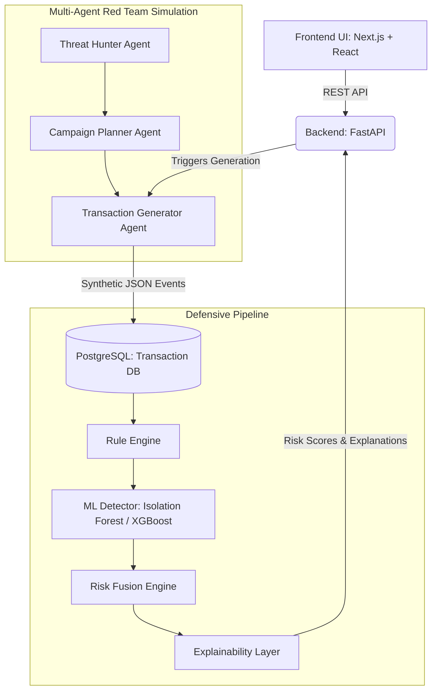

# AI Defense Lab for Payment Security

**A COMPLETE END-TO-END Autonomous AI Red Teaming Platform (Simulation Platform)**
*Designed for the Mastercard Innovation Challenge 2026*

## Overview
The AI Defense Lab is a next-generation security evaluation and synthetic fraud simulation ecosystem. It employs multi-agent LLM systems to act as a simulated Red Team, generating highly complex, realistic fraud campaigns (Account Takeovers, Synthetic Identity rings, AI Voice Clones) in the form of synthetic JSON data. This data continuously stress-tests a multi-layer ML detection pipeline to harden payment networks before day-zero exploits occur.

### Why Mastercard Should Adopt It
1. **Proactive over Reactive**: Instead of waiting for new fraud patterns to hit the network, the Autonomous Threat Evolution engine discovers them in simulation.
2. **Safe & Compliant**: Absolutely zero real exploits or active malware are generated. The entire ecosystem acts as a high-fidelity digital twin of transaction logs, making it safe for internal deployments and ML training without risking production data.
3. **Multi-Agent Innovation**: Uses cutting-edge CrewAI orchestration to mimic sophisticated cyber-criminal syndicates.

## Architecture



## Setup & Deployment (Production Ready)

### Prerequisites
- Docker & Docker Compose
- Node.js (for local UI dev)
- Python 3.10+ (for local Backend dev)

### One-Command Deployment
```bash
docker-compose up --build -d
```
*This spins up the Postgres Database, Redis Cache, FastAPI Backend (Port 8000), and Next.js Frontend (Port 3000).*

## Innovation & Novelty
- **AI vs AI Arena**: The simulation pit pits the Generation Agents against the Detection Models.
- **Explainable Defense**: Every blocked synthetic attack produces a SHAP-like feature importance breakdown, demystifying the ML decision boundary for risk analysts.

## Future Roadmap (2026-2030)
- Integration with live Kafka streams for real-time model shadowing.
- Support for generating multimodal synthetic data (e.g., deepfake voice logs tied to fraudulent transactions).
- Automated Blue Team mitigation script generation.

## Judge FAQs
**Q: Does this platform execute real attacks?**
A: No. It operates entirely as a synthetic data and simulation lab. It generates the *artifacts* (logs, transactions, metadata) of an attack to train models, not the exploit itself.

**Q: Is it scalable?**
A: Yes. The architecture utilizes asynchronous FastAPI, Celery workers (with Redis), and Postgres, fully containerized for Kubernetes deployment.

---
*Created by the world-class engineering team for Mastercard.*
