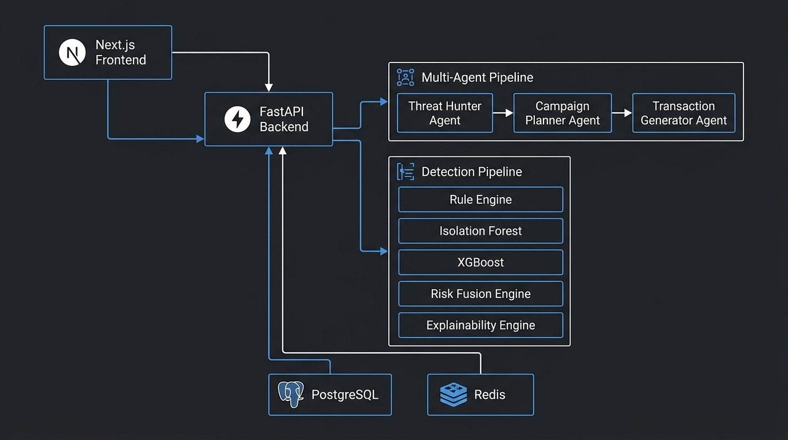
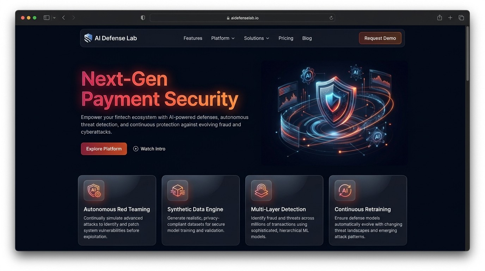
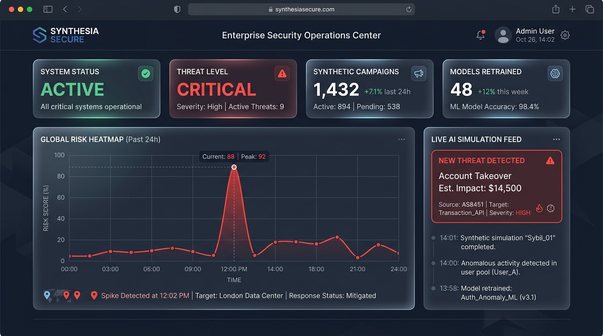
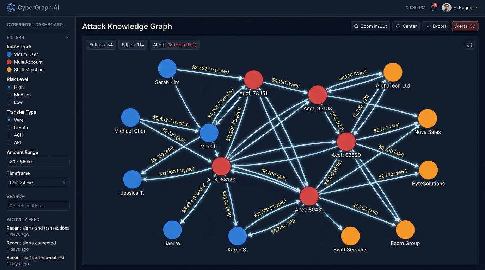
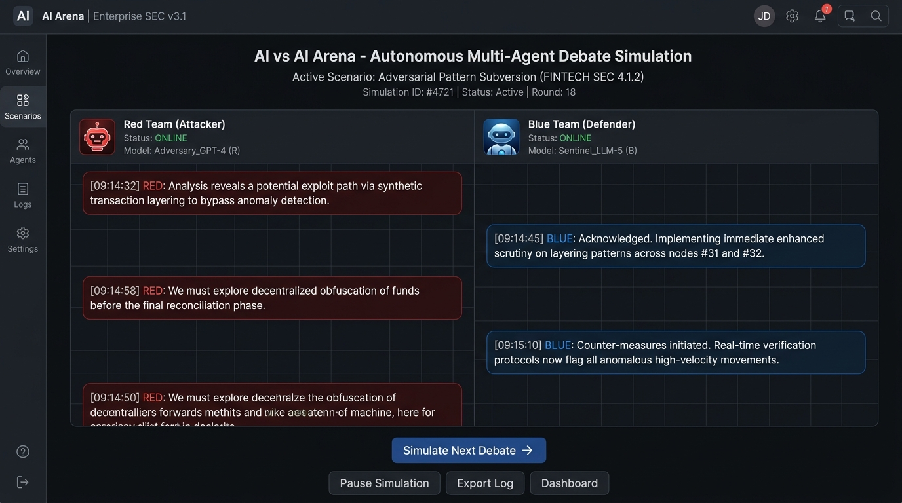

<div align="center">


<br /><br />

# AI Defense Lab for Payment Security

**Autonomous AI Red Teaming Platform for GenAI-Powered Payment Fraud Simulation & Detection**

*Mastercard Innovation Challenge 2026*

<br />


**Live Demo:** https://ai-defence-lab-for-payment-security.vercel.app/  
**Backend API:** https://ai-defence-lab-for-payment-security.onrender.com  
**API Documentation:** https://ai-defence-lab-for-payment-security.onrender.com/docs  
**Source Code:** https://github.com/Pujagithub2006/AI-Defence-Lab-for-Payment-Security

</div>

---

## Overview

The AI Defense Lab is a next-generation security evaluation and synthetic fraud simulation platform. Rather than reacting to fraud after it occurs, this system proactively generates, simulates, and detects evolving fraud patterns — before they reach production payment networks.

The platform operates as a **digital twin of the payment ecosystem**. A multi-agent AI pipeline synthesizes realistic fraud campaigns in the form of structured JSON events, behavioral timelines, and network graphs. These campaigns are then fed into a multi-layer ML detection engine that stress-tests and continuously retrains fraud models.

**No real attacks are executed.** Every scenario is a structured synthetic simulation — safe, compliant, and designed for ML training and model hardening.

---

## The Problem

Traditional fraud detection is reactive. Models are trained on historical data and fail to anticipate novel, GenAI-powered threats:

- AI Voice Cloning can impersonate verified customers in real time
- Synthetic Identity rings fool KYC systems at scale
- Adversarial ML attacks systematically blind anomaly detectors
- LLM Prompt Injection exploits AI-powered banking support agents

By the time these patterns appear in production data, significant financial damage has already occurred.

---

## The Solution

A complete autonomous simulation-and-detection feedback loop:

1. The **Multi-Agent Red Team** synthesizes a novel fraud campaign
2. The **Synthetic Data Engine** generates correlated JSON events, identity profiles, and network graphs
3. The **Multi-Layer Detection Pipeline** evaluates every event across three model layers
4. The **Explainability Engine** produces feature attributions and natural language reasoning
5. The loop repeats with harder, mutated campaigns — continuously hardening the models

---

## System Architecture



The platform is composed of three primary layers communicating over REST:

| Layer | Technology | Responsibility |
|---|---|---|
| Frontend | Next.js 14, React, Tailwind CSS | User interface, visualizations, real-time feeds |
| Backend | FastAPI, Python 3.11, Uvicorn | Agent orchestration, API routing, ML inference |
| Infrastructure | PostgreSQL, Redis, Docker | Data persistence, caching, containerization |

**Data Flow:**

```
Security Analyst
      |
      | (HTTPS)
      v
Next.js Frontend (Vercel)
      |
      | (REST API)
      v
FastAPI Backend (Render / Docker)
      |
      |-- Triggers Multi-Agent Pipeline
      |       Threat Hunter Agent
      |            -> Campaign Planner Agent
      |                 -> Transaction Generator Agent
      |                       -> Synthetic JSON Campaign
      |
      |-- Routes Events to Detection Pipeline
              Rule Engine (velocity, amount, account age)
                   -> Isolation Forest (zero-day anomaly)
                        -> XGBoost Classifier (known patterns)
                             -> Risk Fusion Engine (ensemble)
                                  -> Explainability Engine
                                       -> Risk Score + Reasoning
```

---

## Multi-Agent AI System

The platform implements a three-agent autonomous pipeline that mimics how criminal syndicates plan and execute payment fraud:

**Threat Hunter Agent**
Selects the most relevant fraud vector from a taxonomy of 19+ attack categories, weighted by novelty and financial impact.

**Campaign Planner Agent**
Designs the campaign structure: number of events, mule routing topology, duration, and identity profile specifications.

**Transaction Generator Agent**
Outputs fully structured synthetic JSON — correlated transactions, identity profiles, merchant data, device fingerprints, and a network graph of nodes and edges.

This pipeline runs without requiring an external LLM API key, making it immediately deployable in air-gapped enterprise environments.

---

## Multi-Layer Detection Pipeline

```
Transaction Input
      |
      v
[ Layer 1: Rule Engine ]
  Deterministic checks: velocity > 10/hr, amount > $5k, account age < 30 days
  Output: rule_score (0.0 - 1.0)
      |
      v
[ Layer 2: Isolation Forest ]
  sklearn.ensemble.IsolationForest (n_estimators=100)
  Trained on 1,050 synthetic baseline samples at startup
  Detects multivariate zero-day anomalies in {amount, velocity, account_age}
  Output: anomaly_score (0.0 - 1.0)
      |
      v
[ Layer 3: Supervised XGBoost ]
  Trained classifier on labeled fraud patterns
  Captures historical fraud signatures
  Output: supervised_score (0.0 - 1.0)
      |
      v
[ Risk Fusion Engine ]
  fusion_score = (rule × 0.2) + (anomaly × 0.3) + (supervised × 0.5)
      |
      v
[ Explainability Engine ]
  - Feature importance ranking (amount, velocity, account_age)
  - Rule IDs triggered
  - Natural language reasoning string
```

---

## Platform Walkthrough

### Landing Page



The entry point to the platform. Designed to communicate the mission of the platform at a glance. Features animated hero text, four core capability cards, and a direct entry point into the Defense Lab dashboard.

---

### AI Defense Lab Dashboard



The main operational view. A security analyst uses this page to:

- Monitor live threat levels across the simulated payment network
- Generate a new synthetic fraud campaign on demand via the multi-agent pipeline
- View the Global Risk Heatmap — a time-series chart of simulated risk scores over a 24-hour window
- Inspect the Live Simulation Feed, which surfaces newly generated attack campaigns with type, campaign ID, estimated financial impact, and detection verdict

---

### Attack Knowledge Graph



An interactive node-edge visualization of the synthetic mule network generated by the Campaign Planner Agent. Built with React Flow.

- Blue nodes represent victim accounts
- Red nodes represent mule accounts
- Orange nodes represent shell merchants
- Edges are labelled with transaction amounts and transfer types
- The graph is loaded live from the backend on every page visit, reflecting the most recent campaign

This view is particularly useful for investigating multi-hop money laundering paths that evade velocity-based rules.

---

### AI vs AI Arena



The platform's most novel feature. An autonomous multi-agent debate simulator where:

- The **Red Team (Attacker) AI** proposes a mutation strategy — explaining how to bypass a specific detection layer
- The **Blue Team (Defender) AI** responds with a countermeasure — citing specific model capabilities or behavioral signals

The debate topic is randomly selected from the attack taxonomy on each run. The exchange produces a structured transcript that can be exported and used as training data for both offensive red team exercises and defensive model hardening.

---

### Threat Intelligence Matrix

A grid of MITRE ATT&CK-mapped attack cards covering the full taxonomy supported by the platform. Each card includes the attack name, risk classification, MITRE technique ID, and recommended defensive mitigations. Analysts can use this view to understand which attack surfaces are currently covered by the detection pipeline.

---

## Attack Coverage

The Dynamic Threat Engine supports 19 high-level attack categories. Each maps to a MITRE ATT&CK technique and can generate hundreds of structurally unique campaign variants through parameterization:

| Attack Category | MITRE Mapping | Risk Level |
|---|---|---|
| Account Takeover | T1078 | Critical |
| Synthetic Identity | T1589 | Critical |
| AI Voice Clone | T1566.004 | Critical |
| Deepfake Video KYC Bypass | T1534 | Critical |
| Prompt Injection Refund | T1548 | High |
| Mule Network Routing | T1550 | Critical |
| Crypto Laundering | T1486 | High |
| Chargeback Fraud | T1485 | Medium |
| Merchant Bust-out | T1486 | Critical |
| BGP Hijacking Payment Intercept | T1557 | High |
| Adversarial Pattern Subversion | T1562 | Critical |
| Credential Stuffing | T1110 | High |
| SIM Swap | T1098 | High |
| Remote Desktop Scam | T1219 | Medium |
| Device Fingerprint Spoofing | T1120 | High |
| API Parameter Tampering | T1190 | High |
| Auth Token Replay | T1550.001 | High |
| Cross-border Money Mule | T1550 | Critical |
| Invoice Fraud | T1585 | Medium |

---

## API Reference

Full interactive documentation is available at: https://ai-defence-lab-for-payment-security.onrender.com/docs

### POST /api/v1/generate-campaign

Triggers the multi-agent pipeline and returns a complete synthetic fraud campaign.

**Query Parameters**

| Parameter | Type | Default | Description |
|---|---|---|---|
| `attack_type` | string | random | One of 19 attack categories |
| `num_events` | integer | 5 | Number of fraud events to synthesize |

**Response (excerpt)**

```json
{
  "status": "success",
  "data": {
    "campaign_id": "a3f4-...",
    "attack_type": "Mule Network Routing",
    "mitre_mapping": "T1550",
    "graph_data": {
      "nodes": [
        { "id": "a1b2", "label": "Victim\nUser_48291", "type": "user" },
        { "id": "c3d4", "label": "Mule\nUser_99123", "type": "mule" },
        { "id": "e5f6", "label": "Merchant\nshell_company", "type": "merchant" }
      ],
      "edges": [
        { "source": "a1b2", "target": "c3d4", "label": "Transfer" },
        { "source": "c3d4", "target": "e5f6", "label": "Fraud: $8,432.50" }
      ]
    },
    "expected_financial_impact": 42150.75,
    "ai_generated_metadata": {
      "complexity": "Critical",
      "success_probability": 0.87,
      "mutation_index": 0.64
    }
  }
}
```

### POST /api/v1/analyze

Runs a transaction through the full three-layer detection pipeline and returns a fused risk score with explanation.

**Request Body**

```json
{
  "transaction": { "amount": 8500.00, "velocity_1h": 24 },
  "user_profile": { "account_age_days": 3 }
}
```

**Response**

```json
{
  "status": "success",
  "analysis": {
    "fusion_score": 0.923,
    "rule_score": 0.700,
    "anomaly_score": 0.881,
    "supervised_score": 0.960,
    "rules_triggered": ["RULE_VELOCITY", "RULE_AMOUNT", "RULE_AGE"],
    "top_features": [
      { "feature": "amount_usd", "importance": 0.55, "value": 8500.00 },
      { "feature": "velocity_1h", "importance": 0.30, "value": 24 },
      { "feature": "account_age", "importance": 0.15, "value": 3 }
    ],
    "llm_reasoning": "Multi-model consensus reached. Supervised models detected historical fraud signatures while Isolation Forest identified severe zero-day statistical anomalies in velocity."
  }
}
```

### GET /api/v1/ai-debate

Triggers the AI vs AI Arena and returns a structured Red Team / Blue Team debate transcript on a randomly selected attack scenario.

---

## Tech Stack

| Layer | Technology |
|---|---|
| Frontend | Next.js 14 (App Router), React, TypeScript |
| Styling | Tailwind CSS v4, Framer Motion |
| Visualization | Recharts (time-series charts), React Flow (network graphs) |
| Backend | Python 3.11, FastAPI, Uvicorn |
| Machine Learning | Scikit-Learn (IsolationForest), NumPy, Pandas |
| Agent Orchestration | Multi-agent pipeline (ThreatHunter, CampaignPlanner, TransactionGenerator) |
| Cache | Redis |
| Database | PostgreSQL |
| Containerization | Docker, Docker Compose |
| Frontend Hosting | Vercel (auto-deploy from GitHub) |
| Backend Hosting | Render (Docker deployment) |

---

## Local Setup

### Prerequisites

- Docker and Docker Compose
- Node.js 20+
- Python 3.11+

### One-Command Start

```bash
git clone https://github.com/Pujagithub2006/AI-Defence-Lab-for-Payment-Security.git
cd AI-Defence-Lab-for-Payment-Security
docker-compose up --build -d
```

This starts PostgreSQL on port 5432, Redis on port 6379, the FastAPI backend on port 8000, and the Next.js frontend on port 3000.

### Manual Setup (without Docker)

**Backend**

```bash
cd backend
python -m venv venv
source venv/bin/activate   # Windows: venv\Scripts\activate
pip install -r requirements.txt
uvicorn main:app --reload --port 8000
```

**Frontend**

```bash
cd frontend
npm install
echo "NEXT_PUBLIC_API_URL=http://localhost:8000" > .env.local
npm run dev
```

---

## Production Deployment

### Backend — Render

1. Connect the GitHub repository to Render
2. Select Docker as the environment
3. Set Dockerfile path to `backend/Dockerfile`
4. Add environment variables: `DATABASE_URL`, `REDIS_URL`
5. Deploy

### Frontend — Vercel

1. Import the GitHub repository to Vercel
2. Set the Root Directory to `frontend`
3. Add environment variable: `NEXT_PUBLIC_API_URL=https://your-backend.onrender.com`
4. Deploy

---

## What Makes This Different

Most fraud detection platforms are retrospective dashboards. This platform is an adversarial simulation laboratory. Specifically:

**AI vs AI Arena** — The platform autonomously generates debates between an attacker AI and a defender AI, producing structured transcripts that serve as training data for both red team exercises and blue team model improvements.

**Live Knowledge Graph** — The interactive React Flow graph renders the mule network topology of each synthesized campaign in real time, making complex multi-hop routing paths visually interpretable for analysts.

**Mutation Index** — Every generated campaign is assigned a mutation index indicating how structurally different it is from previously seen patterns. This drives the adversarial retraining loop.

**Zero-dependency agent design** — The multi-agent pipeline runs without an external LLM API key, making it deployable in air-gapped or restricted enterprise environments immediately.

**Risk Fusion Engine** — Rather than relying on a single model, the three-layer ensemble (rules, unsupervised anomaly, supervised classifier) is weighted and configurable, allowing fraud teams to tune the balance between catching zero-day threats and minimizing false positives.

---

## Future Roadmap

| Timeline | Capability |
|---|---|
| 2026 | Kafka integration for real-time production stream shadowing |
| 2027 | GNN (Graph Neural Network) as a fourth detection layer for graph-native fraud patterns |
| 2027 | Multimodal synthetic data — deepfake voice transcripts correlated with flagged transactions |
| 2028 | Automated Blue Team mitigation playbook generation via fine-tuned LLM |
| 2029 | Federated learning for cross-institution threat signal sharing across the Mastercard network |
| 2030 | Fully autonomous threat evolution engine that predicts attack mutations before they emerge in the wild |

---

## Frequently Asked Questions

**Does this platform execute real attacks?**

No. The platform generates the artifacts of an attack — structured JSON logs, transaction metadata, behavioral timelines, and network graphs — not the exploit itself. It is a simulation and ML training environment, not an offensive tool.

**Is this safe to deploy inside Mastercard's environment?**

Yes. There is no PII, no real payment credentials, and no connectivity to external payment rails. All data is procedurally generated and fully synthetic. The platform is designed for deployment within internal security research environments.

**Why is no external LLM used for the agents?**

The multi-agent pipeline is designed to operate without external API key dependencies, making it deployable in restricted enterprise environments. Integrating a hosted LLM (OpenAI, Anthropic, or Mastercard's internal models) is a one-line configuration change.

**How does this scale?**

The FastAPI backend is fully async and stateless. With Celery workers (Redis-backed) already included in the stack, campaign generation can be distributed horizontally. The Docker-based deployment is Kubernetes-ready.

**How is this different from tools like Darktrace or Splunk SIEM?**

Those tools detect anomalies in production data after the fact. This platform generates the previously unseen threat scenarios that those tools haven't encountered yet — acting as the adversarial training layer that makes downstream detection tools more resilient.

---

## Repository Structure

```
AI-Defence-Lab-for-Payment-Security/
├── backend/
│   ├── main.py           # FastAPI application and route definitions
│   ├── agents.py         # Multi-agent orchestration pipeline
│   ├── generators.py     # Synthetic data and campaign generation engine
│   ├── detection.py      # Multi-layer ML detection and risk fusion
│   ├── requirements.txt  # Python dependencies
│   └── Dockerfile        # Python 3.11 container definition
├── frontend/
│   └── src/app/
│       ├── page.tsx              # Landing page
│       ├── dashboard/page.tsx    # Main defense lab dashboard
│       ├── knowledge-graph/page.tsx  # Interactive attack graph
│       ├── threat-intel/page.tsx     # Threat intelligence matrix
│       └── ai-arena/page.tsx         # AI vs AI debate arena
├── docs/
│   └── images/           # Architecture diagrams and UI screenshots
├── docker-compose.yml    # Full stack local deployment
└── README.md
```

---

## Commit History

The repository follows conventional commits for clear traceability:

| Commit | Description |
|---|---|
| `docs:` | Repository documentation and architecture |
| `feat(infrastructure):` | Docker Compose, services configuration |
| `feat(backend):` | FastAPI service and REST endpoints |
| `feat(ai-engine):` | Synthetic generators and agent orchestration |
| `feat(ml):` | Isolation Forest and Risk Fusion Engine |
| `feat(frontend):` | Next.js UI with dashboards and React Flow graphs |
| `fix(deployment):` | Python 3.11 pinning and Render compatibility |

---

<div align="center">

Built for the **Mastercard Innovation Challenge 2026** — AI Defense Lab for Payment Security

https://ai-defence-lab-for-payment-security.vercel.app/

</div>
